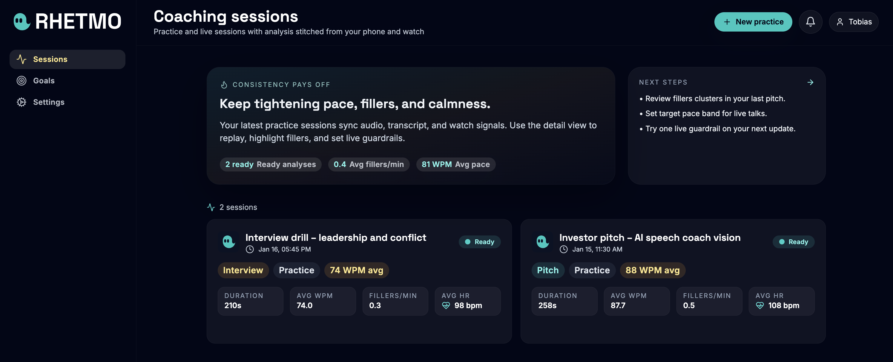
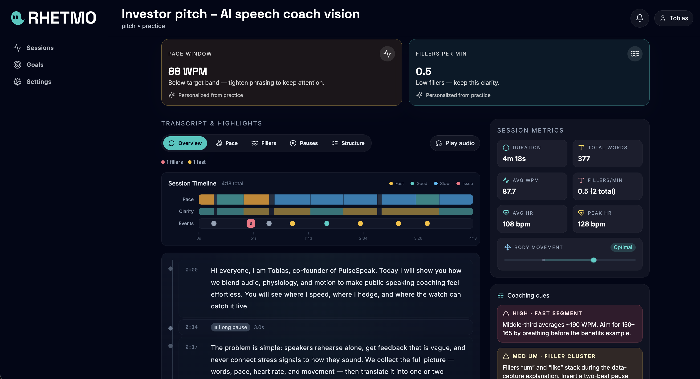
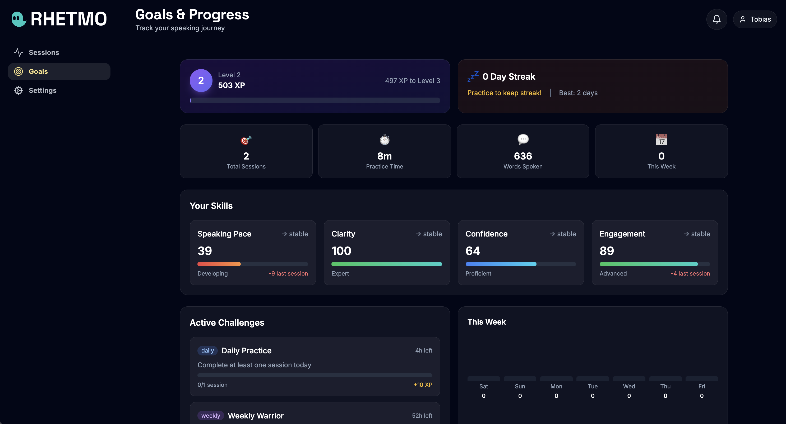

# Rhetmo

**Rhetmo** is an AI-powered speech coaching platform that helps you become a better public speaker. Record your practice sessions, get instant transcription with word-level timing, and receive detailed analysis of your speaking patterns—including filler words, pace variations, and areas for improvement.



---

## What Rhetmo Does

Public speaking is a skill that improves with deliberate practice. Rhetmo provides the feedback loop you need: record yourself speaking, and get comprehensive analysis that shows exactly where you can improve.

### Core Capabilities

**🎙️ Practice Recording**  
Record practice sessions directly in your browser. Audio is captured in chunks and streamed to the backend for real-time transcription using OpenAI's Whisper model.

**📝 AI-Powered Transcription**  
Every word you speak is transcribed with precise timestamps. The system captures not just what you say, but when you say it—down to the millisecond.

**🔍 Filler Word Detection**  
Automatically identifies filler words like "um", "uh", "like", "you know", and other speech disfluencies. See exactly where they occur in your transcript and track your improvement over time.

**📊 Speaking Metrics**  
- **Words per minute (WPM)** – Track your speaking pace
- **Filler frequency** – Fillers per minute across your session
- **Session duration** – Total speaking time with pause detection
- **Segment analysis** – Natural speech segments identified by pauses

**🎯 AI Coaching Insights**  
GPT-powered analysis reviews your entire session and provides:
- Identified issues with severity levels
- Coaching highlights (strengths and areas for improvement)
- Auto-generated session titles that capture your topic

---

## Session Viewer

Dive deep into any recorded session with the detailed session viewer. Every segment of your speech is displayed with its transcript, timing information, and any issues detected.



### Session Viewer Features

**Transcript with Highlights**  
View your full transcript segmented by natural pauses. Each segment shows:
- Exact timing (start and end times)
- Word-level highlighting for fillers and issues
- Duration and word count

**Rhythm Map**  
Visual representation of your speech rhythm showing where you spoke, where you paused, and how your pace varied throughout the session.

**Issues Panel**  
All detected issues in one place—filler words, pace problems, long pauses—with links to jump directly to the relevant segment in your transcript.

**Metrics Dashboard**  
At-a-glance stats for the session including total duration, word count, average WPM, and filler count with per-minute rates.

---

## Goals & Progress

Track your improvement over time with the gamified goals system.



### Goals Features

**XP & Leveling System**  
Earn experience points for completing practice sessions. Level up as you accumulate XP and see your progress toward the next level.

**Skill Tracking**  
Individual skill meters for:
- Filler reduction
- Pace control
- Clarity
- Confidence

Each skill shows your current score, trend direction, and recent changes.

**Streak Tracking**  
Build consistency with daily practice streaks. See your current streak and your all-time best.

**Achievements**  
Unlock achievements for milestones like completing your first session, maintaining streaks, or hitting speaking goals.

**Improvement Areas**  
AI-identified focus areas based on your recent sessions, with suggested exercises to address specific weaknesses.

---

## Technical Architecture

### Frontend

The frontend is a React single-page application built with modern tooling:

- **React 18** – Component-based UI with hooks
- **TypeScript** – Full type safety across the codebase
- **Vite** – Fast development server and optimized production builds
- **Tailwind CSS** – Utility-first styling with custom design tokens
- **React Router** – Client-side routing for navigation
- **Lucide React** – Consistent icon set

### Backend

The backend consists of serverless edge functions running on Supabase:

**`analyze-voice`**  
Receives audio chunks from the frontend, sends them to OpenAI Whisper for transcription, and stores word-level tokens in the database. Each token includes:
- Text content
- Start/end timestamps (milliseconds)
- Conversation ID for grouping

**`clever-service`**  
The main analysis pipeline that runs after recording completes:
1. Fetches all tokens for a conversation
2. Adds punctuation using GPT
3. Segments speech by natural pauses (2+ seconds)
4. Applies rule-based tagging (filler detection, pace analysis)
5. Runs AI analysis for issues and coaching highlights
6. Generates a descriptive title for the session
7. Uploads the complete analysis JSON to storage

The service uses a two-model strategy for cost optimization:
- **GPT-nano** for fast, cheap tasks (punctuation, segmentation, tagging)
- **GPT-mini** for reasoning tasks (issues analysis, coaching highlights)

**`fetchAnalysisResult`**  
Retrieves completed analysis from storage by conversation ID, or returns the most recent analysis if no ID specified.

**`fetchStatus`**  
Lists all conversations with their current status (recording, processing, finished) for the dashboard.

**`quick-worker`**  
Returns a fast, rough preview of a session directly from tokens—useful for showing partial results while the full analysis runs.

### Data Flow

```
Browser Recording → Audio Chunks → analyze-voice → Whisper API → Tokens DB
                                                                    ↓
Session Complete → clever-service → GPT Analysis → Analysis JSON → Storage
                                                                    ↓
Dashboard/Viewer ← fetchAnalysisResult ← Storage Bucket
```

---

## Project Structure

```
├── src/
│   ├── api/              # API client for edge functions
│   │   ├── client.ts     # HTTP client with typed methods
│   │   └── config.ts     # Supabase endpoint configuration
│   ├── components/
│   │   ├── layout/       # App shell, sidebar, top bar
│   │   └── sessions/     # Session-related components
│   │       ├── TranscriptViewer.tsx
│   │       ├── MetricsPanel.tsx
│   │       ├── IssuesPanel.tsx
│   │       ├── RhythmMap.tsx
│   │       └── SessionInsights.tsx
│   ├── pages/
│   │   ├── DashboardPage.tsx
│   │   ├── PracticePage.tsx
│   │   ├── SessionDetailPage.tsx
│   │   ├── GoalsPage.tsx
│   │   └── SettingsPage.tsx
│   ├── types/            # TypeScript interfaces
│   │   ├── sessions.ts   # Session, Analysis, Segment types
│   │   └── goals.ts      # Goals, Skills, Achievements types
│   └── hooks/
│       └── useRecordingService.ts  # Audio recording logic
│
├── supabase-functions/   # Backend edge functions (Deno)
│   ├── analyze-voice.ts
│   ├── clever-service.ts
│   ├── fetchAnalysisResult.ts
│   ├── fetchStatus.ts
│   └── quick-worker.ts
│
└── public/
    └── brand/            # Logos and screenshots
```

---

## Getting Started

### Prerequisites

- Node.js 18 or higher
- npm or yarn

### Installation

```bash
# Clone the repository
git clone https://github.com/yourusername/rhetmo.git
cd rhetmo

# Install dependencies
npm install

# Start the development server
npm run dev
```

Open `http://localhost:5173` in your browser.

### Available Scripts

| Command | Description |
|---------|-------------|
| `npm run dev` | Start development server with hot reload |
| `npm run build` | Type-check and build for production |
| `npm run preview` | Preview production build locally |
| `npm run typecheck` | Run TypeScript type checking |

---

## Backend Configuration

The edge functions require these environment variables in Supabase:

| Variable | Description |
|----------|-------------|
| `SUPABASE_URL` | Your Supabase project URL |
| `SUPABASE_SERVICE_ROLE_KEY` | Service role key (bypasses RLS) |
| `OPENAI_API_KEY` | OpenAI API key for Whisper and GPT |

### Database Schema

**`tokens`** table:
- `id` (uuid)
- `conversation_id` (text)
- `start_ms` (integer)
- `end_ms` (integer)
- `text` (text)
- `tags` (text[])
- `created_at` (timestamp)

**`conversations`** table:
- `conversation_id` (text, primary key)
- `status` (text: 'recording' | 'processing' | 'finished')
- `timestamp` (timestamp)

**Storage bucket `a`**:
- Stores `{conversation_id}-analysis.json` files with complete analysis results
